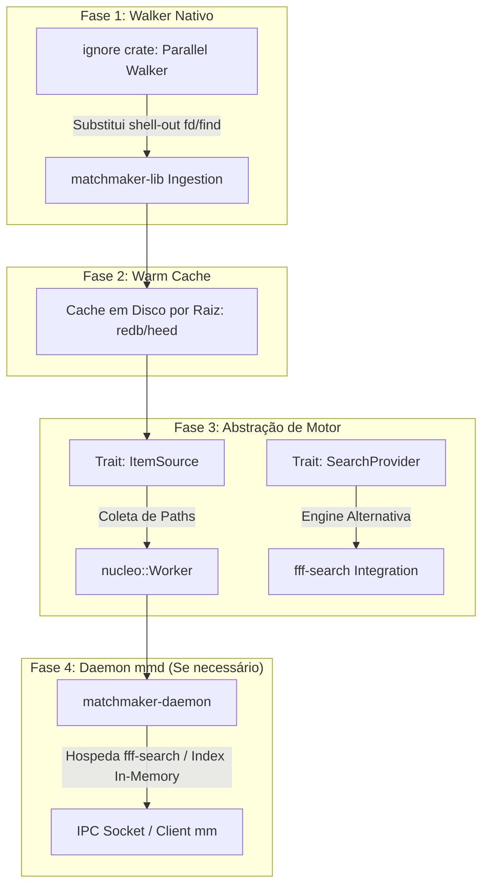

# RFC: Especificação Arquitetural & Roadmap de Desempenho (`matchmaker`)

> **Status:** Aprovado para Planejamento  
> **Destino:** Assistente de IA / Engenheiros Rust  
> **Objetivo:** Evoluir a capacidade de varredura, busca e indexação de arquivos no `matchmaker` em 4 fases incrementais, priorizando menor complexidade operacional, menor latência de startup e extensibilidade.

---

## 📐 Visão Geral do Roadmap



---

## 🚀 Fase 1: Motor Walker Nativo In-Process (`ignore` Crate)

### 🎯 Objetivo
Eliminar a dependência de processos externos (`fd`, `find`) para varredura de diretórios, reduzindo a latência de inicialização (`fork()` + `exec()`) e eliminando parsing de texto no `matchmaker-cli`.

### 📋 Requisitos de Implementação
1. Adicionar a crate **`ignore`** (usada no `ripgrep`) às dependências de `matchmaker-lib`.
2. Implementar `AsyncWalker` em `matchmaker-lib/src/walker.rs`:
   - Respeito nativo a `.gitignore`, `.ignore` e padrões de exclusão globais.
   - Suporte a filtros de arquivos/diretórios e exibição de ocultos (`hidden`).
   - Injeção direta no `nucleo::Worker` via streaming de threads paralelas (`ignore::WalkParallel`).

---

## 💾 Fase 2: Cache de Varredura Persistente por Raiz

### 🎯 Objetivo
Reduzir o tempo de *cold-start* em repositórios massivos (ex: >100.000 arquivos) reutilizando a listagem da execução anterior enquanto um re-scan em background atualiza deltas.

### 📋 Requisitos de Implementação
1. Expandir a utilização do `redb` (já presente em `frecency.rs`) para manter uma tabela de cache por `root_path_hash`.
2. **Estratégia Warm-Start:**
   - Ao abrir `mm` em um diretório: carregar imediatamente a listagem em cache no `nucleo::Worker`.
   - Disparar a Fase 1 (Parallel Walker) de forma assíncrona para detectar arquivos criados ou excluídos.
   - Atualizar a UI e o cache de maneira transparente sem bloquear o primeiro render.

---

## 🧩 Fase 3: Abstração de Fontes & Motores (`ItemSource` & `SearchProvider`)

### 🎯 Objetivo
Permitir a convivência e alternância modular entre o motor padrão do `matchmaker` (`nucleo`) e motores de busca avançados (`fff-search`), mantendo o design desacoplado.

### 📋 Especificação dos Traits (`matchmaker-lib/src/engine.rs`)

```rust
use futures::Stream;
use std::pin::Pin;

/// Interface para fornecedores de listagem de itens (Walkers / Indexadores)
pub trait ItemSource: Send + Sync {
    /// Retorna um stream assíncrono de paths/itens para injeção no nucleo
    fn stream_items(&self) -> Pin<Box<dyn Stream<Item = String> + Send>>;

    /// Indica se o provedor suporta escuta contínua de mudanças de arquivo
    fn supports_watching(&self) -> bool { false }
}

/// Interface para motores alternativos completos de busca e ranking
pub trait SearchProvider: Send + Sync {
    /// Executa a busca estruturada com base na query atual
    fn search(&self, query: &str, limit: usize) -> Vec<SearchResult>;
    
    /// Notifica o motor sobre o acesso a um item para atualizar métricas (frecency/git status)
    fn record_access(&mut self, path: &str);
}
```

### 📦 Integração com `fff-search`
- Adicionar Cargo feature condicional `fff-engine = ["dep:fff-search"]`.
- Implementar `FffSearchProvider` permitindo que o `fff-search` assuma o ranking em modos dedicados (ex: `mm --nav`), mantendo o `nucleo` como padrão para navegação e pipes universais.

---

## ⚡ Fase 4: Daemon Persistente `matchmaker-daemon` (`mmd`)

### 🎯 Objetivo
Fornecer um índice permanente em memória RAM com escuta em tempo real via `notify` para ferramentas CLI efêmeras, garantindo resposta a queries em sub-milissegundos entre invocamentos do terminal.

### 📐 Especificação Arquitetural
- **Em vez de reimplementar a indexação do zero**, o `matchmaker-daemon` hospedará a instância do `fff-search` / `ignore` watcher em segundo plano.
- **IPC Protocol:** Unix Domain Socket em `$XDG_RUNTIME_DIR/matchmaker-$UID.sock` com serialização leve (`postcard` ou `bincode`).
- **Fallback Gracioso:** Se o socket não responder ou o daemon estiver inativo, a CLI `mm` recua instantaneamente para a **Fase 1/2** sem falhar.

---

## 🧪 Critérios de Validação & Benchmarks

1. **Fase 1:** Testar inicialização sem `fd`/`find` instalado; validar que `.gitignore` é respeitado identicamente.
2. **Fase 2:** Medir tempo de primeiro render em repositórios >100k arquivos (`hyperfine "mm --no-tui"`).
3. **Fase 3:** Garantir compilação limpa com e sem a feature `fff-engine`.
4. **Fase 4:** Testar `kill -9` do daemon e verificar se o cliente `mm` realiza fallback transparente sem travar a TUI.
