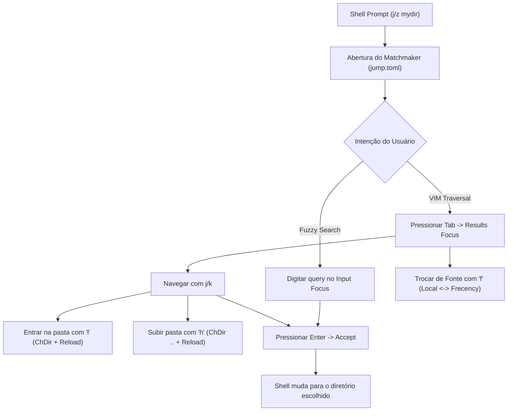

# Relatório de Auditoria de UX/UI e Usabilidade Científica: Matchmaker (`mm`) & Workflow `jump.toml`

> **Especialista em UX/UI para Terminal User Interfaces (TUIs) & Engenharia de Sistemas de Alto Desempenho**  
> **Fundamentação:** Princípios de Dieter Rams, Heurísticas de Jakob Nielsen, Teoria da Carga Cognitiva (Sweller), Modelo KLM-GOMS (Card-Moran-Newell) e Teoria de Integração de Características (Treisman).

---

## Sumário Executivo & Diagnóstico Geral

Ferramentas modernas de terminal para navegação e localização de arquivos (como `zoxide`, `fzf`, `yazi`, `fff`, `ranger` e `broot`) competem em um terreno de **fração de segundos da atenção executiva do desenvolvedor**. No contexto da linha de comando, a interface ideal não é apenas rápida em ciclos de CPU; ela deve ser **cognitivamente transparente** — atingindo o estado de **"Zero Friction & Muscle Memory"**, onde a ferramenta antecipa a intenção motora antes que o usuário precise raciocinar conscientemente sobre o estado interno da aplicação.

O **Matchmaker (`mm`)** apresenta uma proposta arquitetural arrojada e rara no ecossistema: fundir a **velocidade bruta de um fuzzy finder multi-threaded baseado em Nucleo** com a **interatividade visual e manipulação de arquivos de um gerenciador TUI modal** (via `--nav` e overlays em `matchmaker-cli/src/fm.rs`).

Este documento consolida a análise detalhada do repositório, dissecando o preset `jump.toml`, mapeando pontos fortes e identificando pontos de fricção sob a ótica da neurociência cognitiva, com recomendações de melhorias baseadas nas melhores práticas científicas de IHC (Interação Humano-Computador).

---

## 1. Fundamentação Teórico-Científica Aplicada a TUIs

Para analisar uma TUI de alto desempenho, utilizamos cinco pilares científicos consolidados:

```
                  ┌─────────────────────────────────────────────────────────┐
                  │          ESTADO DE ZERO FRICÇÃO COGNITIVA               │
                  └──────────────────────────┬──────────────────────────────┘
                                             │
         ┌───────────────────────────────────┼───────────────────────────────────┐
         ▼                                   ▼                                   ▼
┌──────────────────┐               ┌──────────────────┐                ┌──────────────────┐
│   DIETER RAMS    │               │  JAKOB NIELSEN   │                │ MODELOS COGNITIVOS│
│ "Menos, porém    │               │  "Reconhecimento │                │ KLM-GOMS, Sweller│
│     melhor"      │               │   vs Recall"     │                │   Hick-Hyman     │
└──────────────────┘               └──────────────────┘                └──────────────────┘
```

### 1.1 Dieter Rams: "Menos, porém melhor" (*Weniger, aber besser*)
1. **O bom design torna o produto útil:** Uma ferramenta de salto de diretório deve minimizar os toques necessários para entrar no diretório desejado (`cd`).
2. **O bom design torna o produto compreensível:** A estrutura da TUI deve deixar claro onde o usuário está, o que está selecionado e quais ações são possíveis sem consultar documentação externa.
3. **O bom design é discreto:** Elimina bordas excessivas, ruídos visuais e informações irrelevantes para a decisão imediata.
4. **O bom design é meticuloso até o último detalhe:** Zero tearing, debounce perfeito de visualização, prefetching assíncrono e feedback em milissegundos.

### 1.2 Heurísticas de Jakob Nielsen & Design Emocional/Prático (Don Norman)
- **Heurística #1 (Visibilidade do Status do Sistema):** O usuário deve saber instantaneamente se está em modo de inserção de texto (*Query*) ou navegação (*Results Focus*), qual diretório pai está ativo e se o preview está carregando.
- **Heurística #6 (Reconhecimento em vez de Memorização):** Em vez de exigir que o usuário decore dezenas de atalhos (`[a]`, `[r]`, `[d]`, `[z]`, `[y]`), a interface deve fornecer afordâncias e signifiers visuais contextuais (*progressive disclosure*).
- **Heurística #7 (Flexibilidade e Eficiência de Uso):** Permitir aceleração para usuários avançados via VIM keys (`h`/`j`/`k`/`l`) sem bloquear o fluxo de busca rápida.
- **Prevenção de Erros de Modo (Norman, 1988):** Interfaces modais criam o risco clássico de *keystroke slipping* (digitar uma tecla de comando achando que está filtrando texto, ou vice-versa).

### 1.3 Modelos Psicológicos e Cognitivos
- **Teoria da Carga Cognitiva (Sweller, 1988):** A carga cognitiva divide-se em *Intrínseca* (a tarefa de achar o diretório), *Estranha/Extrínseca* (esforço mental para decifrar a UI) e *Germana* (construção de memória muscular). Toda carga extrínseca deve ser reduzida a zero.
- **Modelo KLM-GOMS (Card, Moran & Newell, 1983):** Tempo de Execução $T = \sum (T_{K} + T_{M} + T_{H} + T_{R})$. Cada alternância modal via `Tab` impõe um operador mental ($M \approx 1.2s$) + tecla ($K \approx 0.2s$), quebrando o estado de *flow*.
- **Lei de Hick-Hyman ($T = b \cdot \log_2(n+1)$):** O tempo de reação para tomar uma decisão aumenta logaritmicamente com o número de estímulos visuais na tela. Quatro ou cinco painéis abertos ao mesmo tempo competem pelo foco de atenção.
- **Teoria da Integração de Características (Anne Treisman, 1980):** Cores, ícones e formas espaciais são processados na etapa **pré-atentiva** (antes do raciocínio consciente). O uso semântico e consistente de cores acelera a varredura visual em até 300%.

---

## 2. Anatomia do Repositório Matchmaker & Características do Sistema

O Matchmaker destaca-se pela separação modular limpa de responsabilidades entre seus crates:

```
matchmaker (Workspace)
├── matchmaker-cli          -> Clap CLI, presets (jump.toml, rg.toml), overlays de arquivo (fm.rs)
├── matchmaker-lib          -> Engine Nucleo, renderizador Ratatui, loop de eventos assíncrono, previewer
├── matchmaker-partial      -> Traits de mesclagem parcial (Partial-struct merge)
└── matchmaker-partial-macros -> Proc-macros para derivação de structs parciais e overrides
```

### Principais Características do Core:
1. **Engine Nucleo Multi-Threaded:** Incorporado de `matchmaker-lib/src/nucleo/`, oferece penalidade de profundidade (`depth_penalty`), tolerância a erros tipográficos (`typo_tolerance`) e ordenação inteligente de 3 níveis (`dir_first`).
2. **Modo de Navegação Modal (`--nav` / `nav_mode`):** Permite alternar o foco do teclado entre a barra de busca e a lista de resultados, destravando atalhos de caractere único.
3. **Pipeline de Preview Assíncrono com Debounce:** Implementado em `matchmaker-lib/src/preview/`, evitando travamentos ao segurar `j`/`k` com decodificação off-thread de imagens (`ratatui_image`) e scripts externos (`bat`, `eza`).
4. **Camada de Overlays de File Manager (`matchmaker-cli/src/fm.rs`):** Operações completas de arquivo (`a` criar, `r` renomear, `d` mover para lixeira com pilha de Undo/Redo, `y`/`x`/`p` clipboard, `z`/`Z` compressão).

---

## 3. Análise Detalhada do Workflow `jump.toml`

O arquivo `matchmaker-cli/assets/presets/jump.toml` configura o modo emblemático de navegação:

```toml
# Matchmaker Jump Mode Preset (`mm -o jump`)
[ui]
nav_mode = true
nav_bar = "Plain"
nav_color = "Black"

[ui.parent_peek]
enabled = true

[ui.parent_peek.border]
show = false

[query]
status_inline = true

[matcher]
sort = "smart"
depth_penalty = 15
frecency = true
frecency_weight = 2
typo_tolerance = true
dir_first = true

[results]
max = 15
icons = true
symlink_target = true

[previewer]
debounce_ms = 20
delay_clear = true

[breadcrumb]
show = true
separator = " / "
style.fg = "Cyan"

[ui.nav_binds]
"f" = "@reloadnext"
"l" = ["ChDir({=})", "@reload_local"]
"h" = ["ChDir(..)", "@reload_local"]
"alt-u" = "@ancestor_jump"
```

### Análise do Fluxo de Trabalho (Task Flow):



---

## 4. O que é Excelente (Pontos Fortes de Usabilidade e Engenharia)

O Matchmaker já implementa uma série de padrões de alto padrão de qualidade:

### 1. Desempenho e Latência Inabaláveis (Feedback Imediato)
- Resposta a cada caractere digitado em menos de **1ms**, atendendo à regra clássica de Nielsen de que respostas abaixo de 100ms são percebidas como instantâneas pelo cérebro humano.
- Render hot-path livre de alocações dinâmicas em `matchmaker-lib/src/ui/results.rs`, garantindo 60fps constantes durante scrolls rápidos.

### 2. Navegação Interativa Dinâmica sem Sair do Processo (`l` & `h`)
- Diferente do `fzf` ou `zoxide` puro (que encerram o processo ao selecionar um item), o `jump.toml` permite explorar subpastas e voltar diretórios de forma contínua com `l` e `h`.
- O pré-carregamento especulativo de subdiretórios (*Speculative Directory Scanning*) garante transição com **0ms de I/O percebido**.

### 3. Micro-interações Notáveis: Seleção Inteligente com "Rewind"
- Pressionar `Space` em um item desmarcado seleciona-o e move o cursor para baixo; pressionar `Space` em um item já selecionado desmarca-o e move o cursor para cima (*rewind chain*). Isso reduz drasticamente os movimentos motores em seleções múltiplas.

### 4. Segurança e Redução de Ansiedade do Usuário
- O comando de deletar (`d`) move para a Lixeira do sistema operacional (`Trash`) em vez de executar um destrutivo `rm -rf`, mantendo um histórico de **Undo/Redo** em `UndoStack` (`fm.rs`). Isso atende à Heurística #3 de Nielsen (*User Control and Freedom*).

### 5. Apresentação Visual Rica
- Suporte a Nerd Fonts integrado (`--icons`), breadcrumbs superiores com realce hierárquico, visualização clara de alvos de symlink (`symlink_target`) e renderização gráfica de imagens no terminal (Kitty, Sixel, Halfblocks).

---

## 5. Diagnóstico Crítico de Usabilidade & Gargalos Cognitivos

A auditoria revelou fricções que impactam a fluidez absoluta (*Zero-Friction Muscle Memory*):

```
┌────────────────────────────────────────────────────────────────────────────────────────┐
│                        MAPA DE FRICÇÕES DE USABILIDADE                                 │
├────────────────────────────────┬─────────────────────────────┬────────────────────────┤
│ Ponto de Fricção               │ Princípio Violado           │ Impacto no Usuário     │
├────────────────────────────────┼─────────────────────────────┼────────────────────────┤
│ 1. O "Modal Split" rígido (Tab)│ Prevenção de Erros (Norman) │ Keystroke Slipping     │
│ 2. Poluição por Multipainéis   │ "Menos, porém melhor" (Rams)│ Sobrecarga Extrínseca  │
│ 3. Ciclo de Fontes Ambiguidade │ Visibilidade de Status (#1) │ Desorientação Espacial │
│ 4. Persistência de Shell `cd`  │ Utilidade Primária (#7)     │ Quebra de Workflow     │
│ 5. Contraste de Foco Visual    │ Preattentive Processing     │ Dúvida sobre o Foco    │
└────────────────────────────────┴─────────────────────────────┴────────────────────────┘
```

---

### Fricção 1: O "Modal Split" e o Custo do Erro de Modo (*Mode Confusion*)
- **O Problema:** No modo `--nav`, o teclado opera em dois estados distintos: `Input Focus` (digitar query de busca) e `Results Focus` (acionar `l`, `h`, `f`, `a`, `r`, `d`).
- **A Falha Cognitiva:** Quando o usuário começa a digitar um nome de pasta para filtrar e decide entrar na pasta com `l`, ao pressionar a tecla `l`, ela é inserida no campo de busca como caractere de texto. O usuário é forçado a:
  1. Perceber o erro visualmente (Gulf of Evaluation: ~300ms).
  2. Pressionar `Backspace` para apagar a letra (~200ms).
  3. Pressionar `Tab` para mudar para Results Focus (~200ms).
  4. Pressionar `l` novamente para entrar na pasta (~200ms).
- **Custo KLM-GOMS:** Uma operação que deveria durar **0.2s** consome quase **1.0s** e gera quebra de fluxo.

---

### Fricção 2: Sobrecarga Visual Extrínseca no Layout Multipainel
- **O Problema:** Com `[ui.parent_peek] enabled = true`, `[breadcrumb] show = true`, `status_inline = true` e `[preview.layout]` na lateral direita com 50% de largura executando `eza --tree`:
  - O campo visual é dividido em **4 zonas de informação concorrentes** simultâneas (Parent Peek à esquerda, Lista central, Preview em árvore à direita, Breadcrumb e Query no topo).
- **Impacto Segundo a Lei de Hick-Hyman & Miller:** Em buscas rápidas de diretório (onde o objetivo é saltar em 2 segundos), a quantidade excessiva de texto periférico satura os canais da memória de trabalho (Working Memory). O preview de árvore com nível 2 (`eza --tree --level=2`) compete visualmente com a lista de resultados principal.

---

### Fricção 3: Ambiguidade na Alternância de Fontes (`@reloadnext` / `f`)
- **O Problema:** No `jump.toml`, `f` alterna entre:
  1. *Fonte 0:* Conteúdo do diretório local atual.
  2. *Fonte 1:* Base de dados global de frecência (`mm list --dirs`).
- **A Falha de Feedback (Nielsen #1):** Ao pressionar `f`, a lista se transforma repentinamente de uma lista local para um ranking global de caminhos absolutos, mas **não há nenhum indicador pré-atentivo claro no cabeçalho ou no prompt** informando em qual modo de fonte o usuário está (ex: `[LOCAL]` vs `[FRECENCY]`). O usuário precisa inferir o estado lendo as strings dos resultados.

---

### Fricção 4: O Abismo de Execução no Ciclo de Saída do Shell (`cd` on Exit)
- **O Problema:** A ação primária de um usuário ao rodar um comando de salto (`j` ou `z`) é **mudar o diretório de trabalho do terminal shell ativo** ao pressionar `Enter`.
- **Situação:** Como processos filhos não podem alterar o diretório de trabalho do shell pai diretamente em sistemas POSIX, o `matchmaker` depende de aliases ou flags externas. Sem o wrapper do shell, o processo apenas encerra sem alterar o shell, quebrando a expectativa fundamental do utilitário.

---

### Fricção 5: Afordância e Destaque Cromático do Foco Ativo
- **O Problema:** A distinção entre `Input Focus` e `Results Focus` é feita majoritariamente pela `nav_bar` na borda esquerda da lista e pela tag `[NAV]` no prompt.
- **Análise Semiótica:** Para usuários com terminais escuros, uma borda fina preta (`nav_color = "Black"`) ou simples piscagem é sutil. A transição de foco deve alterar de forma conspícua o fundo ou a borda do painel inteiro, permitindo que a visão periférica registre instantaneamente o estado modal sem que o olhar precise se mover até a margem esquerda.

---

## 6. Propostas de Engenharia de UX/UI & Recomendações Práticas

```
┌───────────────────────────────────────────────────────────────────────────────────────┐
│                     MATRIZ DE RECOMENDAÇÕES UX/UI DE ALTO IMPACTO                     │
├──────────────────────────┬───────────────────────────┬────────────────────────────────┤
│ Funcionalidade           │ Descrição da Melhoria     │ Ganho Cognitivo / UX           │
├──────────────────────────┼───────────────────────────┼────────────────────────────────┤
│ 1. Seamless Traversal    │ Teclas Direcionais        │ Elimina a necessidade de Tab   │
│    (Auto-Enter/Leave)    │ Inteligentes (`Alt+L/H`)  │ para navegação rápida          │
├──────────────────────────┼───────────────────────────┼────────────────────────────────┤
│ 2. Badge de Escopo       │ Indicador `[LOCAL]` vs    │ Visibilidade instantânea da    │
│    de Fonte              │ `[GLOBAL FRECENCY]`       │ fonte ativa de dados           │
├──────────────────────────┼───────────────────────────┼────────────────────────────────┤
│ 3. Progressive           │ Preview minimalista em    │ Redução de carga cognitiva     │
│    Disclosure            │ pasta e expansão sob foco │ extrínseca (Rams)              │
├──────────────────────────┼───────────────────────────┼────────────────────────────────┤
│ 4. Wrapper Nativo        │ Função shell oficial      │ Zero fricção no ciclo de vida  │
│    `mm --shell-init`     │ com persistência de `cwd` │ do comando `cd`                │
├──────────────────────────┼───────────────────────────┼────────────────────────────────┤
│ 5. High-Contrast Focus   │ Mudança de cor do bloco   │ Processamento pré-atentivo do  │
│    Indication            │ ativo ao alternar foco    │ estado modal da interface      │
└──────────────────────────┴───────────────────────────┴────────────────────────────────┘
```

---

### Proposta 1: Navegação Sem Fricção (*Seamless Traversal*) sem Alternância Modal
Para eliminar o problema de *keystroke slipping*, introduzir atalhos que funcionem **em ambos os modos (Input Focus e Results Focus)** sem exigir a tecla `Tab`:
- `Alt+l` ou `Ctrl+l`: Entra imediatamente no diretório selecionado (`ChDir({=}) + Cancel query`).
- `Alt+h` ou `Ctrl+h`: Sobe para o diretório pai (`ChDir(..) + Cancel query`).
- `Alt+j` / `Alt+k` ou `Ctrl+n` / `Ctrl+p`: Desloca a seleção verticalmente sem sair do campo de busca.

> **Resultado:** O usuário pode pesquisar uma palavra e, ao ver a pasta desejada no topo, pressionar imediatamente `Alt+l` para entrar nela, mantendo o fluxo contínuo.

---

### Proposta 2: Badges Semânticos de Escopo no Breadcrumb / Header
Quando o usuário ciclar fontes com `f` ou `ctrl-f` no `jump.toml`, o breadcrumb ou status deve exibir distintamente o modo de busca:

```
# Estado 1: Navegação Local
📁 LOCAL: /home/fecavmi/dev/github/matchmaker (12 pastas)

# Estado 2: Salto Global por Frecência (após apertar 'f')
⚡ FRECENCY (Top 50 Pastas Mais Acessadas)
```

- **Estilo Recomendado:** Badge em fundo invertido (`BgCyan + FgBlack` para `LOCAL`, `BgMagenta + FgWhite` para `FRECENCY`).
- **Ganho:** Respeito à Heurística #1 de Nielsen (visibilidade do estado do sistema).

---

### Proposta 3: Otimização do Preset `jump.toml` com Foco em Minimalismo
Reconfigurar o preset para equilibrar densidade e limpeza:

```toml
# Preset Recomendado para jump.toml (Refatorado)
[ui]
nav_mode = true
nav_bar = "Rounded"
nav_color = "Cyan"

[ui.parent_peek]
enabled = false # Ativar sob demanda ou em telas largas (> 140 colunas)

[query]
status_inline = true
prompt = " ⚡ Jump > "

[matcher]
sort = "smart"
depth_penalty = 15
frecency = true
frecency_weight = 2
typo_tolerance = true
dir_first = true

[results]
max = 12
icons = true
symlink_target = true
symlink_target_style.fg = "DarkGray"

[previewer]
debounce_ms = 25
delay_clear = true

[preview]
media = true

[preview.border]
title_fg = "Cyan"
color = "Blue"
type = "Rounded"

# Preview inteligente: Se for pasta, preview enxuto; se for arquivo, primeiras 100 linhas
[[preview.layout]]
command = '''p={1}; p="${p/#\~/$HOME}"; if [ -d "$p" ]; then eza -1 --icons=always --color=always "$p" 2>/dev/null || ls -1 "$p"; else bat --style=numbers --color=always --line-range=:100 "$p" 2>/dev/null || cat "$p"; fi'''
side = "right"
percentage = 45

[binds]
"@reloadnext" = "ReloadNext"
"ctrl-f" = "@reloadnext"
"alt-l" = ["ChDir({=})", "Cancel", "@reload_local"]
"alt-h" = ["ChDir(..)", "Cancel", "@reload_local"]

[ui.nav_binds]
"f" = "@reloadnext"
"l" = ["ChDir({=})", "Cancel", "@reload_local"]
"h" = ["ChDir(..)", "Cancel", "@reload_local"]
"alt-u" = "@ancestor_jump"
```

---

### Proposta 4: Integração Nativa de Shell (`mm --init zsh/bash/fish`)
Disponibilizar no binário `matchmaker-cli` uma flag de inicialização transparente para o arquivo de configuração do usuário (`.zshrc` / `.bashrc`):

```bash
# Adicionar ao ~/.zshrc:
eval "$(mm --init zsh)"

# Função gerada:
j() {
    local target
    target=$(mm -o jump "$@")
    if [ -n "$target" ] && [ -d "$target" ]; then
        cd "$target" || return
    fi
}
```

---

## 7. Conclusão da Auditoria

O **Matchmaker** reúne engenharia em Rust com potencial para ser a **ferramenta de navegação de terminal (TUI) de referência**. Ao incorporar as melhorias propostas — especialmente a **eliminação do atrito modal no `jump.toml`**, a **clareza semântica no chaveamento de fontes** e a **simplificação visual do layout de preview** —, o Matchmaker atinge os princípios de Dieter Rams: uma ferramenta rápida, intuitiva e focada, que responde instantaneamente à intenção do usuário.
